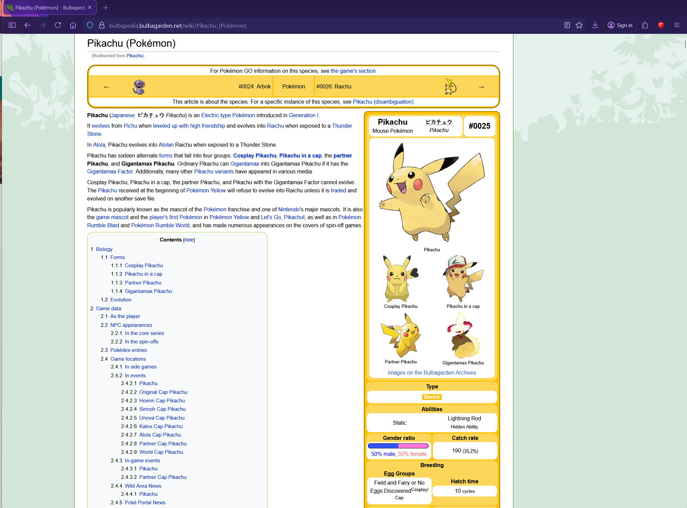
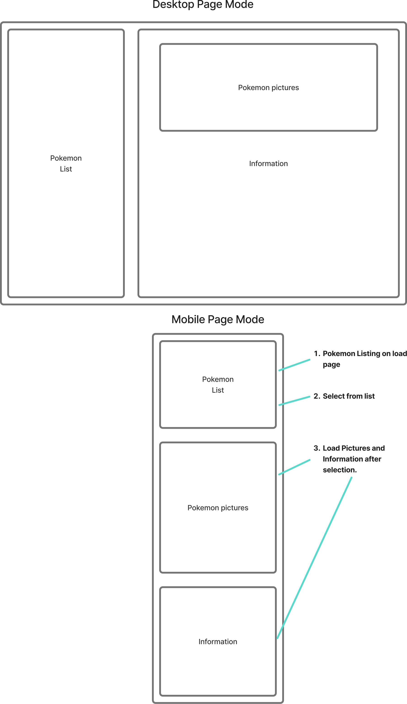
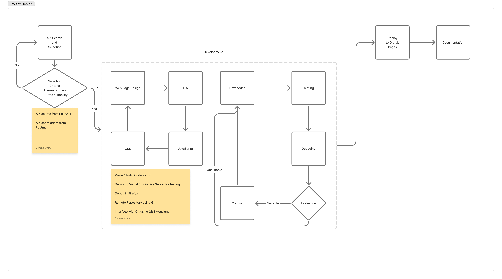
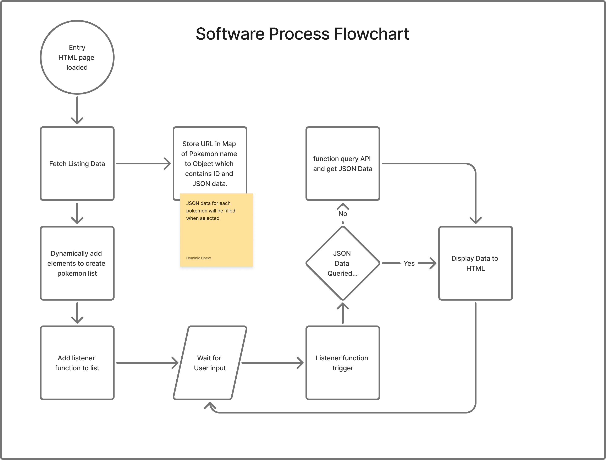
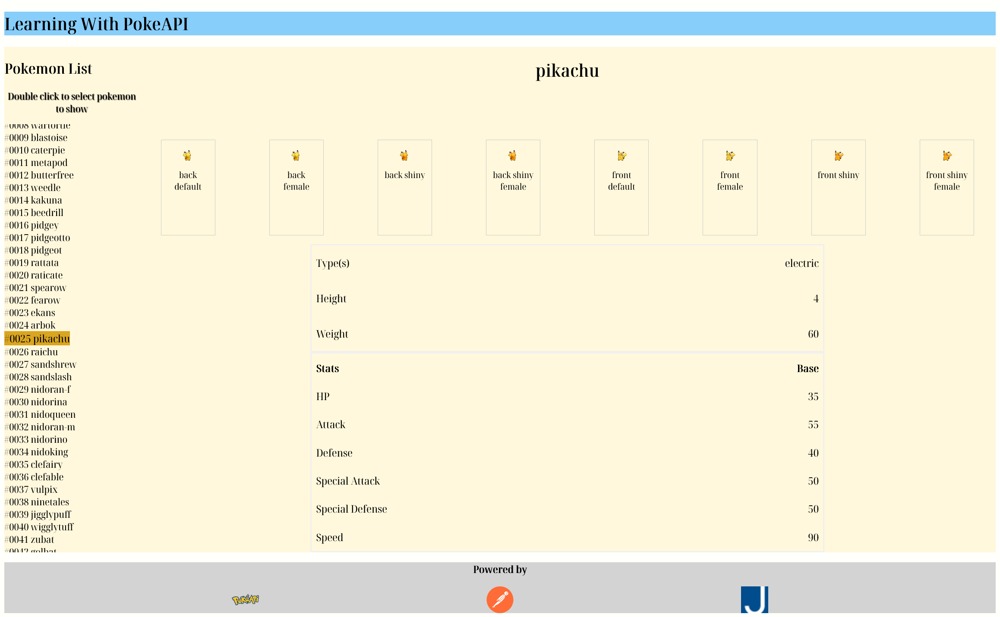
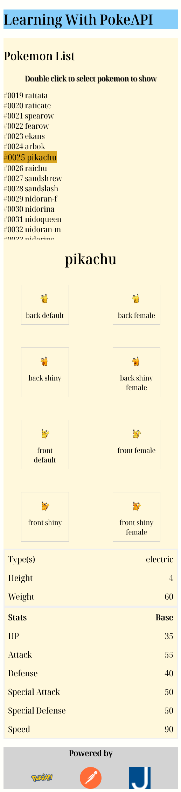

# Learning With Pokemon API
The objective is to list all the current pokemon and to allow user to select one pokemon at a time to view certain information.\
[Github repository page](https://github.com/dominicchewbowei/learning_with_pokemon_api/)\
[Github Page](https://dominicchewbowei.github.io/learning_with_pokemon_api/)\
[FigJam](https://www.figma.com/board/tf7y7FKVEnRTEFS9y07SIa/Learning-with-Pokemon-API?node-id=0-1&t=tccJ9lROgpShTaqD-1)

---

## Inspiration:
[Bulbapedia](https://bulbapedia.bulbagarden.net/wiki/Main_Page)


---

## Page Design

---

## Project Design

1. Investigate and verify PokeAPI API calls on Postman.
2. Study JSON format
3. Design Webpage.
4. Decide which data to include from API.
5. Development on Visual Studio Code.
6. Testing on Visual Studio Code Live Server.
7. Upload to Github and deployment to Github Pages.
8. Documentation. 

---

## Software Design
1. HTML File [index.html](index.html)
- static elements
- link to JavaScript file and CSS file
2. CSS File [style.css](style.css)
- Element arrangement
- Font sizes and colours
- Element colours
- Borders and margins
3. Javascript File [script.js](script.js)
- Dynamically add elements
- Dynamically change classes for effects
- Fetch API JSON data and insert to HTML elements
- Listener function to display data


---

## JSON Data

1st API ```https://pokeapi.co/api/v2/pokemon?limit=100000&offset=0```\
.results[i].name\
.results[i].url
2md API ```https://pokeapi.co/api/v2/pokemon/`Pokemon ID Number`/```\
.types[0].type.name\
.types[1].type.name\
.height\
.weight\
.sprites.back_default\
.sprites.back_female\
.sprites.back_shiny\
.sprites.back_shiny_female\
.sprites.front_default\
.sprites.front_female\
.sprites.front_shiny\
.sprites.front_shiny_female\
.stats[0].base_stat\
.stats[1].base_stat\
.stats[2].base_stat\
.stats[3].base_stat\
.stats[4].base_stat\
.stats[5].base_stat\

---

## Development Setup
1. Create a repository in Github.
2. Create a Github Access token.
3. USing Github Access Token and Remote Repository Token on Git Extensions, clone a local repository.
4. Ensure the necessary files in the local directory.
5. Visual Studio Code IDE for file editing.
6. Create a live server with the html file [index.html](index.html).

---

## Current Webpage
\


---

## Credits
### References
[W3Schools](https://www.w3schools.com/) for HTML, CSS and Javascript\
[MDN](https://developer.mozilla.org/) for HTML, CSS and Javascript\

### Resources Utilized in Development
[PokeAPI](https://pokeapi.co/) The RESTful Pokémon API\
[Postman](https://www.postman.com/) for Query API call script\
[JSON Path Finder](https://jsonpathfinder.com/) for visualizing JSON Data\
[Visual Studio Code](https://code.visualstudio.com/) for development environment\
[Github](https://github.com/) for remote git repository and remote deployment of webpage\
[Google Gemini](https://gemini.google.com) for code samples\
[Deepseek](https://www.deepseek.com) for code samples\
[Firefox Web Browser](https://www.firefox.com/) for testing and debugging\
[Git](https://git-scm.com/) for versioning\
[Git Extensions](https://gitextensions.github.io/) for Git UI\